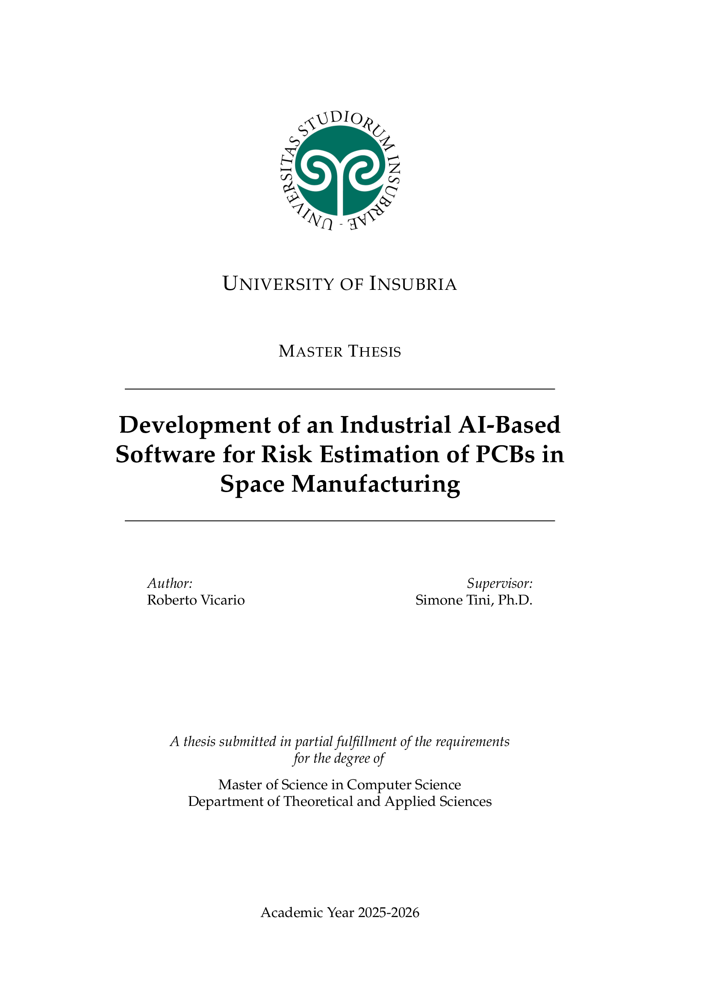

|  |
| - |

# Development of an Industrial AI-Based Software for Risk Estimation of PCBs in Space Manufacturing

This repository contains my personal thesis submitted in partial fulfillment of the requirements for the degree of Master of Science in Computer Science at the University of Insubria.

## Abstract

Not yet available.

## Thesis

| 
| - |

## License

This project is distributed under [Creative Commons Attribution-NonCommercial-ShareAlike 4.0 International](https://creativecommons.org/licenses/by-nc-sa/4.0). You can find the complete text of the license in the project repository.
